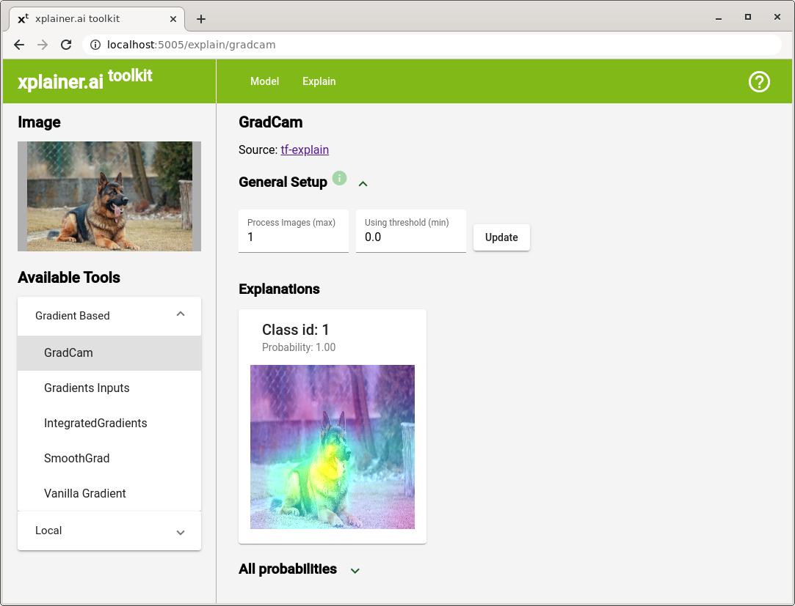

# xplainer toolkit 0.0.1
The ultimate goal of this toolkit is to promote explainable AI. 
It should offer developers varied ways to examine predictions of their models.

We are just at the beginning of a long road. For a start, we decided to aim at:
- Image classification.
- Tensorflow 2+ models.

There are already a couple of existing libraries. We do not want to duplicate them.
This project rather tries to make them available with as little effort as possible,
at one place.

## How To Start
- Install our pip package (we recommend to do so inside Python [venv](https://docs.python.org/3/library/venv.html)).
```bash
pip install xplainer
```
- Optionally install GraphViz. It is used only to draw model 
[plot](https://www.tensorflow.org/api_docs/python/tf/keras/utils/plot_model), 
therefore you can skip this if you do not need to see it.

- Run following command with the path to the model you would like to explore:
```bash
xplainer --model /path/to/your/model .
```

Open the browser, type http://localhost:5005/ and you are ready to go!
(Port is fixed at the moment.)

<p align="center">
  
</p>

## How It Works
This is a web based application. The backend is built on Flask, frontend on Angular 10.
At the moment, it is not ready to be used separately as an online tool. 

## Roadmap
The immediate goal is to integrate as many libraries 
and algorithms for a current domain - image classification. After that, another domain / technologies will be added. 

In parallel, the application itself will be improved. 

## Install From Source
To install the app from source, you need to build the frontend first. 
To do so, install npm and Node.js. After that, you can start the build. 
```bash
cd xplainer/webapp/
ng build --prod
```

When you are finished, simply install it using pip. 
(Preferably into a virtual environment.)
```bash
pip install -e .
```

### Development
For development, it is best to start frontend and backend separately. For backend, run following command:
```bash
xplainer/backend/main.py  /path/to/your/model/
```

For frontend, use:
```bash
cd cd xplainer/webapp/
ng serve
```

This way, Flask will not start the build frontend. 
Instead, you can take advantage of `ng serve` capabilities to rebuild the frontend on file changes.

Both parts now run on a different port. CORS are handled by Flask.

### Adding a Tool
At the moment, all tools are placed in a [xplainer/backend/tools](xplainer/backend/tools) directory.
To add a new tool, you need to implement the `AbstractTool` interface.
The backend checks this directory and offers the available tools to the frontend.

The structure of a tool is very simple now, it will have to be extended.
However, this uniformity should be preserved for an easy incorporation of many tools.


## Acknowledgments
I would like to thank the authors of a survey book
[Explainable AI: Interpreting, Explaining and Visualizing Deep Learning ](https://www.springer.com/gp/book/9783030289539).
It is a great way to start with explainable AI and discover a huge number of resources.

### Libraries Used
- https://github.com/sicara/tf-explain
- https://github.com/marcotcr/limet
